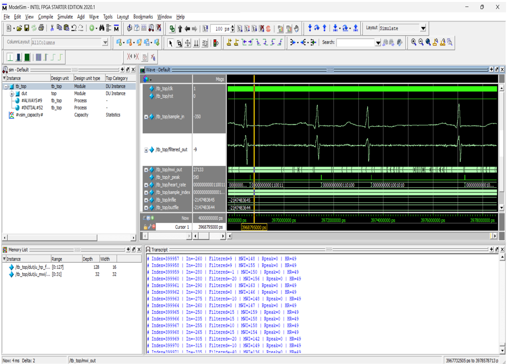

# VLSI-Based ECG Signal Denoising & Heart Rate Detection

> Modular RTL architecture in Verilog HDL for real-time ECG processing

## Overview
A VLSI-based digital signal processing system that denoises ECG signals 
and detects heart rate in real-time using modular RTL design. Implemented 
in Verilog HDL and verified via functional simulation in ModelSim.

## Block Diagram
| Module | Function |
|--------|----------|
| `adc_if.v` | ADC interface — samples incoming ECG signal |
| `hp_filter.v` | High-pass filter — removes baseline wander noise |
| `derivative.v` | Derivative computation for slope detection |
| `metrics.v` | R-peak detection & heart rate calculation |
| `tb/tb_top.v` | Functional testbench with stimulus |

## Simulation Results

### ECG Waveform — Input vs Filtered Output

**Observations:**
- `sample_in` — raw ECG signal with noise
- `filtered_out` — denoised ECG signal after HP filter
- `r_peak` — R-peak detection flag
- `heart_rate` — calculated BPM output

### Key Metrics
| Parameter | Value |
|---|---|
| Filter Type | High-Pass FIR |
| R-peak Detection | Derivative + threshold method |
| Heart Rate Output | Real-time BPM calculation |
| Simulation Tool | ModelSim Intel FPGA Starter Edition 2020.1 |
| Testbench | Functional simulation with synthetic ECG data |
| Target Platform | FPGA |

## Project Structure
ECG_VLSI_PROJECT/

├── rtl/          # Verilog source files

├── tb/           # Testbench

├── data/         # ECG sample data

├── results/      # Simulation output

└── scripts/      # Simulation scripts

## How to Run
1. Open ModelSim
2. Run `simulate.do` script
3. View waveform — `sample_in` vs `filtered_out`

## Author
Heebert Roshan T | ECE, Kongunadu College of Engineering and Technology
